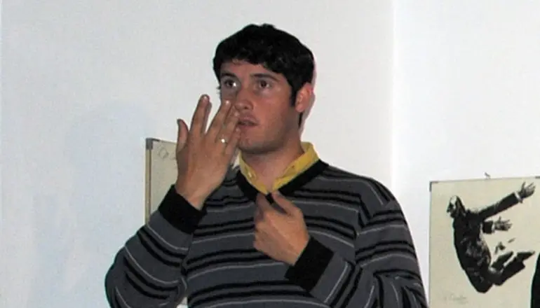

Long before I started thinking about product strategy, engineering workflows, or modern web stacks, I had an experience that shaped the way I communicate far more than any framework ever did.

In 2011, I worked as a sign language interpreter during exhibitions and public openings at Museo Dámaso Arce in Olavarría.

At first glance, that might look unrelated to software.

It wasn’t.

That experience taught me something I still carry into every product, interface, and system I build: communication is only real when it reaches the other person clearly.

Interpreting is not just about converting words. It is about understanding intent, context, rhythm, tone, and meaning — then rebuilding that meaning in a way that actually works for someone else. In many ways, great software design is the same exercise.

You can have a powerful system, a smart architecture, or a polished interface. But if people can’t understand it, trust it, or move through it naturally, the job is unfinished.

Looking back, that side path shaped a lot of what came later.

It shaped the way I explain technical ideas.  
It shaped the way I think about accessibility.  
It shaped the way I value clarity over noise.  
And it shaped the kind of builder I wanted to become.

Years later, I would go on to work on health information systems, engineering platforms, and sports software. I would also speak publicly about health information systems and their challenges and opportunities. But this earlier experience already contained the seed of something important: the idea that technology is never just about systems — it is also about people, understanding, and access.

That is probably why I still care so much about making complex things feel usable.

Not simpler in a shallow way.  
Clearer in a human way.

Some of the most valuable things that shaped my work did not happen behind a keyboard.

And this was one of them.