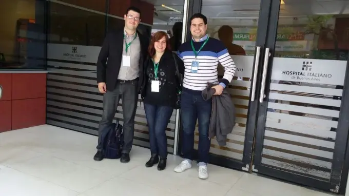

In 2016, I was part of a team from Olavarría connected to digital government work that presented experiences around health information systems at the Hospital Italiano in Buenos Aires.

At that point, I was no stranger to software. But speaking about these systems in a public setting made something clearer to me:

software is very easy to talk about in technical terms, and much harder to explain in terms of real impact.

Health information systems make that impossible to ignore.

When you work close to that kind of environment, you quickly realize that software is not just a set of screens, forms, or integrations. It becomes part of how people register information, make decisions, coordinate care, reduce errors, and build trust in the daily workflow.

That changes the way you think.

It pushes you to care more about clarity.  
It pushes you to care more about structure.  
It pushes you to care more about reliability.  
And it reminds you that complexity is not impressive on its own unless it becomes usable.

Speaking publicly about that kind of work also taught me another lesson: building is only part of the job.

The other part is being able to explain what a system does, why it matters, and what problems it is actually solving.

That has stayed with me ever since.

Years later, whether I am working on engineering platforms, product experiences, or sports software, I still carry the same idea with me:

good software should not only function correctly. It should make important work easier to understand, easier to trust, and easier to move forward.

Looking back, that experience was not just about presenting a project.

It was about learning to see software as part of a bigger system — one made of people, processes, responsibility, and communication.

For me, that lesson never stopped being relevant.

Backlink: [Olavarría en las Jornadas Universitarias de Sistemas de Información en Salud](https://lu32.com.ar/locales/olavarria-en-las-jornadas-universitarias-de-sistemas-de-informacion-en-salud_a6837af927af5dba70a5f0b1d)