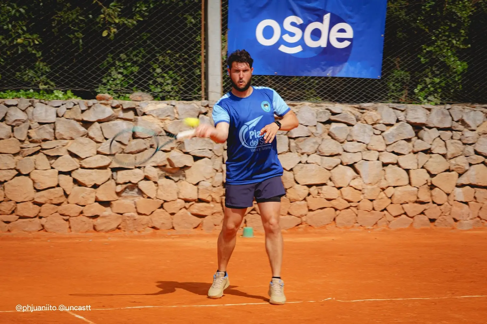

[EntrenoLibre](https://entrenolibre.com) did not begin exactly as it exists today.

Its first version was broader, more exploratory, and more startup-shaped. The idea at that stage was to build a sports-tech platform connecting trainers, clubs, and users through a mobile-first experience. That earlier phase ran actively from 2017 to 2021 and was recognized by Santander X, earning a place at Babson College’s StartUp JumpStart program. The public project summary on Darío Schmidt’s site also describes a 3-person team and explicitly lists [Darío Schmidt](https://darioschmidt.com), [Matías Cáceres](https://www.instagram.com/caceres_matias/), and Saulo Vargas as collaborators.  

That stage mattered a lot.

It was where the project gained its first real structure:
market research, MVP thinking, strategic decisions, club conversations, surveys, and early validation work around the sports space.

It was also an important team effort.

Darío publicly describes leading market research, strategic decisions, and MVP development during that phase, while Matías Cáceres brought additional reach and creative energy to the project. Today, Matías presents himself publicly as a creator with a strong audience on Instagram, where his site highlights more than 18.6K followers.

## Why sports software became personal

My commitment to sports apps comes from something very simple: I actually care about the world they serve.

Tennis has been a real part of my life for years through tournaments, club participation, and local competition. That closeness made it easier to see the everyday friction around sports communities: disorganized communication, weak visibility for clubs, scattered tournament management, and too many manual processes everywhere.

That is why EntrenoLibre never felt like a random startup idea.

It felt like a product I had reasons to keep believing in.

Not because I liked the category.
Because I knew the reality.

## What changed

Over time, the project became more concrete.

Instead of staying broad as a general sports-tech concept, EntrenoLibre evolved into a much more focused product: a platform for organizing sports events, managing registrations and matches, sharing live results, and giving clubs and organizers better visibility with their communities.

That current positioning is clearly reflected on the site today, where EntrenoLibre is presented around:

- creating sports events
- managing registrations, matches, brackets, and scores
- sharing live updates with the community
- helping clubs and organizers communicate tournaments more effectively

I think that evolution was a strength, not a contradiction.

The original version helped validate the space.
The later version clarified the product.

## What I want to highlight from that journey

One of the most important things about EntrenoLibre was never just the product itself.

It was the process behind it.

This was a real attempt to understand a market, build an MVP, test assumptions, gather feedback, and make strategic decisions with a small team trying to find the strongest version of the idea.

That is why I still see that early phase as valuable.

It proved that the project could gain external recognition.
It proved that the idea had enough substance to enter serious entrepreneurship spaces.
And it proved that we were able to work as a small team around research, product thinking, and execution.

Later, the pivot made the value proposition sharper.

The project moved closer to a very concrete problem:
helping sports organizers and clubs run events better, communicate results in real time, and create a better experience around tournaments and community participation.

Looking back, that journey feels honest.

Not a straight line.
But a real one.

And in product work, that often matters more.

Because sometimes the first version gives you the ambition.
The pivot gives you the clarity.